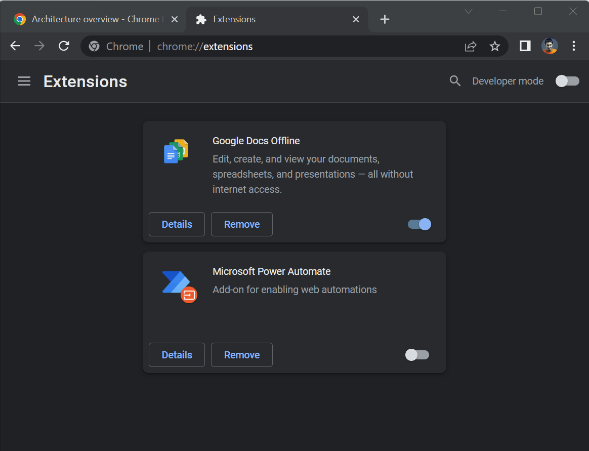

# Text2Events
```
prj_owner: A7
prj_created: 03/11/2022 10:00 AM
prj_status: WIP
```

## Intro
At my current workspace, comms suck.
I just recieved a message on MS Teams that we have a meeting. Out of 9 people no one bothered to copy details for the event to schedule a meeting invite for the calendar.



## Idea
There needs to be a user friendly way to
select text and let the computer parse those instructions - to begin with: scheduling events
in the calendar of your choice.

## Devel
Create cross-platform software to schedule 
calendars tasks from just text.
Host:
- Web Browser: Extension
- Native Operating System: 
  - Android/iOS - Mobile app
  - Windows - Desktop application

**Frontend**:
User selects text and shares it/gets context menu button. The text is send as a POST request.
**Backend**: A backend API parses the text,
processes it through the NLP engine. This
helps it understand what response to send to user to help them create calendar events.

How to customize calendar actions in responses ?

## Deply